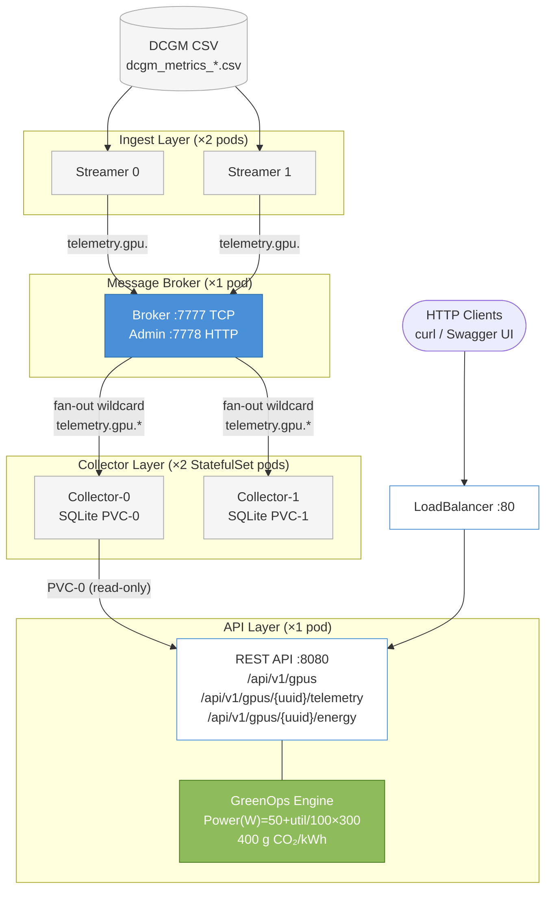

# GPU Telemetry Platform

A production-grade GPU observability pipeline built in Go. Ingests DCGM metrics from CSV, routes them through a custom TCP message-queue broker, persists to SQLite, and exposes a REST API with GreenOps energy analytics.

---

## Architecture



> **GreenOps components** (highlighted in green) compute per-GPU energy consumption via trapezoidal integration and estimate CO₂ at a configurable grid intensity (default 400 g CO₂/kWh).

---

## Components

| Binary | Role | Port |
|--------|------|------|
| **broker** | Custom in-memory TCP MQ with glob topic matching | `7777` (MQ), `7778` (admin HTTP) |
| **streamer** | Reads DCGM CSV, publishes each row as JSON to `telemetry.gpu.<id>` | — |
| **collector** | Subscribes `telemetry.gpu.*`, batch-writes to SQLite (500 records / 2 s) | — |
| **api** | Gin REST API with Swagger UI and GreenOps energy endpoints | `8080` |

---

## 1. Running Locally

### Prerequisites

| Requirement | Version | Notes |
|-------------|---------|-------|
| Go | 1.22+ | [go.dev/dl](https://go.dev/dl/) |
| swag CLI | latest | Required once to generate the Swagger spec. Install with `go install github.com/swaggo/swag/cmd/swag@latest`. Ensure `$GOPATH/bin` is on your `PATH`. |

A sample DCGM metrics CSV is included at `data/sample_metrics.csv`. The streamer uses this by default.

### Quick start — single script

**Linux / macOS:**
```bash
chmod +x scripts/start-local.sh
./scripts/start-local.sh

# To use a custom CSV:
STREAMER_CSV=/path/to/your/metrics.csv ./scripts/start-local.sh
```

**Windows (PowerShell):**
```powershell
# Optional: set a custom CSV path
$env:STREAMER_CSV = "C:\path\to\your\metrics.csv"
.\scripts\start-local.ps1
```

The script regenerates the Swagger spec, builds all four binaries, starts all services in the background, and waits until the API is healthy.

To stop all processes:
```bash
./scripts/stop-local.sh        # Linux / macOS
.\scripts\stop-local.ps1       # Windows
```

### Manual start (four terminals)

```bash
# Step 1 — Regenerate Swagger spec (run once; re-run after editing API annotations)
swag init -g cmd/api/main.go -o docs

# Step 2 — Build all binaries
make build

# Terminal 1
make run-broker

# Terminal 2
make run-collector

# Terminal 3 — uses data/sample_metrics.csv by default
make run-streamer
# Custom CSV:  STREAMER_CSV=/path/to/file.csv make run-streamer

# Terminal 4
make run-api
```

### Verify

```bash
curl http://localhost:8080/health
# {"status":"ok"}

curl http://localhost:8080/api/v1/gpus | jq .
curl http://localhost:8080/api/v1/broker/stats | jq .

# Interactive Swagger UI
open http://localhost:8080/swagger/index.html   # macOS
start http://localhost:8080/swagger/index.html  # Windows
```

---

## 2. Docker + Kubernetes

### Prerequisites

| Tool | Purpose |
|------|---------|
| Docker 24+ | Build the container image |
| kubectl | Deploy and manage Kubernetes resources |
| A Kubernetes cluster | minikube, kind, Docker Desktop, EKS, GKE, or any conformant cluster |

### Step 1 — Build the Docker image

The Dockerfile uses a multi-stage build (`golang:1.22-alpine` builder, `alpine:3.20` runtime). All four binaries and `data/sample_metrics.csv` are baked into a single ~15 MB image. No CGO or C toolchain is required.

```bash
docker build -t gpu-telemetry:latest .
```

### Step 2 — Make the image available to the cluster

Choose the option that matches your environment:

**Docker Desktop** — no action required (shares the local Docker daemon).

**minikube:**
```bash
minikube image load gpu-telemetry:latest
```

**kind:**
```bash
kind load docker-image gpu-telemetry:latest
```

**Remote cluster — push to a registry:**
```bash
docker tag gpu-telemetry:latest <registry>/<repo>/gpu-telemetry:latest
docker push <registry>/<repo>/gpu-telemetry:latest

# Update the image field in every manifest:
sed -i 's|image: gpu-telemetry:latest|image: <registry>/<repo>/gpu-telemetry:latest|g' k8s/*.yaml
```

### Step 3 — Deploy

Use the provided deployment script (handles image loading, manifest apply, and rollout wait):
```bash
chmod +x scripts/k8s-deploy.sh
./scripts/k8s-deploy.sh

# minikube:
CLUSTER_TYPE=minikube ./scripts/k8s-deploy.sh

# Remote registry:
REGISTRY=myregistry.io/myteam IMAGE_TAG=v1.0.0 ./scripts/k8s-deploy.sh
```

Or apply manifests manually in the required order:
```bash
kubectl apply -f k8s/namespace.yaml   # 1. Create namespace gpu-telemetry
kubectl apply -f k8s/broker.yaml      # 2. Broker Deployment + Service
kubectl apply -f k8s/collector.yaml   # 3. Collector StatefulSet + PVC
kubectl apply -f k8s/streamer.yaml    # 4. Streamer Deployment (initContainer waits for broker)
kubectl apply -f k8s/api.yaml         # 5. API Deployment (mounts collector-0 PVC read-only)
```

> **Order matters.** The collector must be created before the API so that the PVC (`collector-data-collector-0`) exists. The streamer's `initContainer` blocks on a TCP check to `broker:7777` before the main container starts.

### Step 4 — Verify pods

```bash
kubectl get pods -n gpu-telemetry -w
```

Expected steady state (~60 s):
```
NAME                  READY   STATUS    RESTARTS
broker-xxx            1/1     Running   0
collector-0           1/1     Running   0
collector-1           1/1     Running   0
streamer-xxx          1/1     Running   0
streamer-xxx          1/1     Running   0
api-xxx               1/1     Running   0
```

### Step 5 — Access the API

```bash
# Forward the API service to your laptop
kubectl port-forward -n gpu-telemetry svc/api 8080:8080
```

In a second terminal:
```bash
curl http://localhost:8080/health
curl http://localhost:8080/api/v1/gpus | jq .
curl http://localhost:8080/api/v1/broker/stats | jq .
open http://localhost:8080/swagger/index.html
```

### Step 6 — View logs

```bash
kubectl logs -n gpu-telemetry deploy/broker          -f
kubectl logs -n gpu-telemetry statefulset/collector  -f
kubectl logs -n gpu-telemetry deploy/streamer        -f
kubectl logs -n gpu-telemetry deploy/api             -f
```

### Step 7 — Tear down

```bash
kubectl delete namespace gpu-telemetry
# PVCs are retained by default. To remove them:
kubectl delete pvc -n gpu-telemetry --all
```

### Using a custom CSV file in Kubernetes

**Option A — ConfigMap** (files ≤ 1 MiB):

```bash
kubectl create configmap gpu-metrics \
  --from-file=metrics.csv=/path/to/your-file.csv \
  -n gpu-telemetry
```

Add the following to the `streamer` container spec in `k8s/streamer.yaml`:
```yaml
env:
  - name: STREAMER_CSV
    value: "/app/data/custom/metrics.csv"
volumeMounts:
  - name: custom-csv
    mountPath: /app/data/custom
volumes:
  - name: custom-csv
    configMap:
      name: gpu-metrics
```

**Option B — Copy file via a temporary pod** (files > 1 MiB):

```bash
# Start a temporary pod with a PVC mounted
kubectl run csv-loader --image=busybox --restart=Never -n gpu-telemetry \
  --overrides='{
    "spec": {
      "volumes": [{"name":"data","persistentVolumeClaim":{"claimName":"streamer-data"}}],
      "containers": [{"name":"csv-loader","image":"busybox","command":["sleep","3600"],
        "volumeMounts":[{"mountPath":"/data","name":"data"}]}]
    }
  }'

kubectl cp /path/to/your-file.csv gpu-telemetry/csv-loader:/data/metrics.csv
kubectl delete pod csv-loader -n gpu-telemetry
```

Set `STREAMER_CSV: /data/metrics.csv` and mount the PVC in `k8s/streamer.yaml`.

**CSV column format** — columns must appear in this exact order:

| Index | Column |
|-------|--------|
| 0 | `timestamp` (RFC3339) |
| 1 | `metric_name` |
| 2 | `gpu_id` |
| 3 | `device` |
| 4 | `uuid` |
| 5 | `model_name` |
| 6 | `hostname` |
| 7 | `container` |
| 8 | `pod` |
| 9 | `namespace` |
| 10 | `value` |
| 11 | `labels_raw` (optional) |

---

## 3. API Reference

The full interactive Swagger UI is available at `http://localhost:8080/swagger/index.html` when the API is running.

All error responses follow RFC 7807 (`application/problem+json`):
```json
{ "type": "invalid_param", "detail": "limit max is 10000" }
```

---

### GET /health

Liveness probe. Returns HTTP 200 when the service is up. Used by Kubernetes liveness and readiness probes.

**Response:**
```json
{"status": "ok"}
```

---

### GET /api/v1/gpus

Returns all GPU UUIDs observed in the telemetry database along with their latest metadata (model, hostname, device name). Use this endpoint to discover available GPU identifiers before querying telemetry.

**Response:**
```json
{
  "count": 64,
  "items": [
    {
      "uuid": "GPU-5fd4f087-86f3-7a43-b711-4771313afc50",
      "model_name": "NVIDIA A100 80GB PCIe",
      "hostname": "node-01",
      "device": "nvidia0"
    }
  ]
}
```

---

### GET /api/v1/gpus/{uuid}/telemetry

Returns paginated time-series telemetry records for a specific GPU. Records are returned in descending timestamp order.

**Path parameter:**

| Parameter | Description |
|-----------|-------------|
| `uuid` | GPU UUID obtained from `GET /api/v1/gpus` |

**Query parameters:**

| Parameter | Type | Default | Description |
|-----------|------|---------|-------------|
| `metric_name` | string | — | Filter to a single metric, e.g. `DCGM_FI_DEV_GPU_UTIL` |
| `start_time` | RFC3339 | — | Earliest record inclusive, e.g. `2025-07-18T20:00:00Z` |
| `end_time` | RFC3339 | — | Latest record inclusive |
| `limit` | int | 100 | Page size (max 10 000) |
| `offset` | int | 0 | Page offset for pagination |

**Response:**
```json
{
  "count": 5,
  "limit": 5,
  "offset": 0,
  "items": [
    {
      "timestamp": "2025-07-18T20:00:05Z",
      "metric_name": "DCGM_FI_DEV_GPU_UTIL",
      "gpu_id": "0",
      "uuid": "GPU-5fd4f087-86f3-7a43-b711-4771313afc50",
      "model_name": "NVIDIA A100 80GB PCIe",
      "hostname": "node-01",
      "value": 87.5
    }
  ]
}
```

**Example:**
```bash
curl "http://localhost:8080/api/v1/gpus/GPU-5fd4f087-.../telemetry?metric_name=DCGM_FI_DEV_GPU_UTIL&limit=50"
```

---

### GET /api/v1/gpus/{uuid}/telemetry/summary

Returns statistical aggregates — min, max, mean, P50, P90, P99 — for a specific metric over a time window. Use for SLA reporting and capacity planning.

**Query parameters:**

| Parameter | Type | Required | Description |
|-----------|------|----------|-------------|
| `metric_name` | string | Yes | Metric to aggregate, e.g. `DCGM_FI_DEV_GPU_UTIL` |
| `start_time` | RFC3339 | No | Start of window |
| `end_time` | RFC3339 | No | End of window |

**Response:**
```json
{
  "uuid": "GPU-5fd4f087-...",
  "metric_name": "DCGM_FI_DEV_GPU_UTIL",
  "window_start": "2025-07-18T20:00:00Z",
  "window_end": "2025-07-18T21:00:00Z",
  "sample_count": 720,
  "min": 12.0,
  "max": 98.5,
  "mean": 65.2,
  "p50": 67.0,
  "p90": 92.0,
  "p99": 97.8
}
```

**Example:**
```bash
curl "http://localhost:8080/api/v1/gpus/GPU-5fd4f087-.../telemetry/summary?metric_name=DCGM_FI_DEV_GPU_UTIL&start_time=2025-07-18T20:00:00Z&end_time=2025-07-18T21:00:00Z"
```

---

### GET /api/v1/gpus/{uuid}/energy

Computes energy consumption (Wh) and CO₂ emission estimate for a GPU over a time range. Uses `DCGM_FI_DEV_GPU_UTIL` and a linear power model with trapezoidal integration.

**Power model:**
```
Power (W)   = 50 + (utilisation% / 100 × 300)
Idle        = 50 W   (0% utilisation)
Peak        = 350 W  (100% utilisation)
Energy (Wh) = trapezoidal integration over Power(t)
CO₂ (g)     = Energy_kWh × 400 g/kWh
```

**Query parameters:**

| Parameter | Type | Description |
|-----------|------|-------------|
| `start_time` | RFC3339 | Start of energy window |
| `end_time` | RFC3339 | End of energy window |

**Response:**
```json
{
  "uuid": "GPU-5fd4f087-...",
  "energy_wh": 312.4,
  "co2_grams": 124.96,
  "sample_count": 720,
  "window_start": "2025-07-18T20:00:00Z",
  "window_end": "2025-07-18T21:00:00Z"
}
```

**Example:**
```bash
curl "http://localhost:8080/api/v1/gpus/GPU-5fd4f087-.../energy?start_time=2025-07-18T20:00:00Z&end_time=2025-07-18T21:00:00Z"
```

---

### GET /api/v1/broker/stats

Proxies the broker admin `/stats` endpoint and returns real-time message-queue diagnostics. All counters are cumulative since broker start — compute the delta between two polls for a per-second rate.

**Response:**
```json
{
  "topics": 64,
  "subscribers": 2,
  "total_published": 2470,
  "total_delivered": 2470,
  "total_dropped": 0,
  "drop_rate_pct": 0.0,
  "note": "counters are cumulative since broker start; diff between polls for per-second rates"
}
```

---

### GET /api/v1/cluster/stranded-compute

Identifies GPUs that have been completely idle over a lookback window while still drawing idle baseline power (50 W). Use to reclaim unused GPU capacity and reduce energy waste.

**Query parameters:**

| Parameter | Type | Default | Description |
|-----------|------|---------|-------------|
| `window` | duration | `15m` | Lookback window, e.g. `30m`, `1h` |
| `max_util` | float | `0` | Max utilisation % to classify as stranded (0 = fully idle) |

**Response:**
```json
{
  "window": "15m0s",
  "since": "2025-07-18T20:45:00Z",
  "max_util_pct": 0,
  "stranded_count": 3,
  "total_wasted_wh": 37.5,
  "total_wasted_co2_g": 15.0,
  "items": [
    {
      "uuid": "GPU-abc...",
      "hostname": "node-02",
      "model_name": "NVIDIA A100 80GB PCIe",
      "idle_power_w": 50,
      "wasted_energy_wh": 12.5,
      "wasted_co2_g": 5.0
    }
  ]
}
```

**Example:**
```bash
curl "http://localhost:8080/api/v1/cluster/stranded-compute?window=30m"
```

---

### GET /api/v1/cluster/anomalies

Scans recent utilisation telemetry across all GPUs using rule-based detection to surface failure signals.

**Detection rule — PerformanceDrop:** GPU utilisation spikes above 95 % and then collapses by ≥ 50 percentage points within the next 5 consecutive samples. This pattern indicates thermal throttling, a driver error, or workload preemption.

**Query parameters:**

| Parameter | Type | Default | Description |
|-----------|------|---------|-------------|
| `window` | duration | `30m` | Lookback window, e.g. `1h` |

**Response:**
```json
{
  "window": "30m0s",
  "since": "2025-07-18T20:30:00Z",
  "anomaly_count": 1,
  "items": [
    {
      "uuid": "GPU-def...",
      "hostname": "node-01",
      "type": "PerformanceDrop",
      "detail": "utilisation dropped from 97.0% to 12.0% within 5 samples",
      "detected_at": "2025-07-18T20:47:12Z"
    }
  ]
}
```

**Example:**
```bash
curl "http://localhost:8080/api/v1/cluster/anomalies?window=1h"
```

---

### GET /swagger/index.html

Interactive Swagger UI. The OpenAPI spec is embedded in the binary at build time via `swag init`. No additional tooling is required at runtime.

---

## 4. Environment Variables

### broker

| Variable | Default | Description |
|----------|---------|-------------|
| `MQ_ADDR` | `:7777` | TCP listen address for the MQ protocol |
| `MQ_ADMIN_ADDR` | `:7778` | HTTP listen address for admin endpoints |
| `LOG_LEVEL` | `info` | Log verbosity: `debug`, `info`, `warn`, `error` |

### streamer

| Variable | Default | Description |
|----------|---------|-------------|
| `STREAMER_CSV` | — | **Required.** Path to the DCGM metrics CSV file |
| `MQ_ADDR` | `:7777` | Broker TCP address |
| `STREAMER_LOOP` | `true` | Re-stream on EOF (continuous mode). Set `false` for one-shot. |
| `STREAMER_DELAY` | `50ms` | Delay between consecutive row publishes |
| `STREAMER_TOPIC_PFX` | `telemetry.gpu` | Per-GPU topic prefix |
| `LOG_LEVEL` | `info` | Log verbosity |

### collector

| Variable | Default | Description |
|----------|---------|-------------|
| `COLLECTOR_DB` | `./telemetry.db` | SQLite database file path |
| `MQ_ADDR` | `:7777` | Broker TCP address |
| `COLLECTOR_TOPIC` | `telemetry.gpu.*` | Subscription topic glob pattern |
| `COLLECTOR_BATCH_SIZE` | `500` | Number of records per write transaction |
| `COLLECTOR_FLUSH_INT` | `2s` | Maximum time between flushes |
| `LOG_LEVEL` | `info` | Log verbosity |

### api

| Variable | Default | Description |
|----------|---------|-------------|
| `API_ADDR` | `:8080` | HTTP listen address |
| `API_DB` | `./telemetry.db` | SQLite database path |
| `API_READ_TIMEOUT` | `15s` | HTTP request read timeout |
| `BROKER_ADMIN_ADDR` | `localhost:7778` | Broker admin address for stats proxy |
| `LOG_LEVEL` | `info` | Log verbosity |

---

## 5. MQ Protocol

Custom length-prefix TCP framing: 4-byte big-endian `uint32` payload length followed by a JSON-encoded `Frame`.

```
┌────────────────────┬────────────────────────────────────────┐
│  Length (4 bytes)  │  JSON Frame payload (variable length)  │
└────────────────────┴────────────────────────────────────────┘
```

| Frame type | Direction | Purpose |
|------------|-----------|---------|
| `pub` | client → broker | Publish a message to a topic |
| `sub` | client → broker | Subscribe to a topic pattern |
| `unsub` | client → broker | Unsubscribe from a pattern |
| `msg` | broker → client | Deliver a matched message |
| `ack` | broker → client | Acknowledge a `pub` or `sub` |
| `err` | broker → client | Report a protocol error |
| `ping` | client → broker | Keepalive probe |
| `pong` | broker → client | Keepalive response |

Topic matching uses Go's `path.Match` glob semantics. The subscription `telemetry.gpu.*` matches `telemetry.gpu.0`, `telemetry.gpu.7`, etc.

Broker admin HTTP endpoints on `:7778`:
- `GET /health` — returns `{"status":"ok"}`
- `GET /stats` — returns cumulative message counters and topic/subscriber counts

---

## 6. Development

### Build and run

```bash
make build            # compile all four binaries → bin/
make clean            # remove bin/ and generated artefacts
```

### Test

```bash
make test             # all unit and integration tests
make test-race        # with -race detector enabled
make test-coverage    # HTML coverage report → coverage.html
```

### Lint

```bash
make lint             # requires golangci-lint in PATH
make vet
```

### Regenerate Swagger spec

Re-run whenever API handler annotations (`// @Summary`, `// @Param`, `// @Router`, etc.) in `cmd/api/main.go` are changed:

```bash
go install github.com/swaggo/swag/cmd/swag@latest
make docs
# Equivalent: swag init -g cmd/api/main.go -o docs
```

The generated files (`docs/docs.go`, `docs/swagger.json`, `docs/swagger.yaml`) are committed to the repository so the binary embeds the spec without requiring `swag` at runtime.

---

## 7. Production Considerations

| Concern | Current implementation | Recommended production path |
|---------|----------------------|-----------------------------|
| Message broker | In-memory, single replica; state lost on restart | NATS, Kafka, or RabbitMQ |
| Persistence | SQLite per collector pod | InfluxDB, VictoriaMetrics, or Prometheus remote-write for a unified queryable store |
| API ↔ storage | Mounts `collector-0` PVC read-only | Replace with a shared distributed store; remove volume mount and pod affinity |
| PVC access mode | `ReadWriteOnce` + pod affinity hint for co-location | `ReadWriteMany` StorageClass (NFS, CephFS) for multi-node clusters |
| Authentication | None | Add an API gateway with token authentication or mTLS between components |
| TLS | None | Terminate TLS at the ingress controller or load balancer |
| Observability | Broker `/stats` HTTP endpoint | Export Prometheus metrics; add Grafana dashboards |
| Collector scaling | Each pod owns an independent SQLite file; API only reads collector-0 | Route all collectors to a shared backend so every pod contributes to a unified data view |

---

## 8. AI Assistance Documentation

This section fulfils the project requirement to document how AI assistance was used throughout the development workflow.

---

### Overview

GitHub Copilot (Claude Sonnet model via VS Code) was used heavily across all phases of this project — from initial scaffolding through to final deployment tooling. The table below summarises which parts were AI-accelerated vs manually driven.

| Phase | AI contribution | Manual intervention required |
|-------|----------------|------------------------------|
| Project scaffolding | High — directory layout, `go.mod`, `Makefile` skeleton | Adjusted module path and binary names |
| Custom MQ design | Medium — initial interface and broker struct | Rewrote glob-matching and frame-protocol logic for correctness |
| Streamer implementation | High — CSV parsing, topic routing, loop/signal handling | Tuned column index constants to match actual CSV schema |
| Collector implementation | High — subscribe loop, batch flush, SQLite writes | Fixed transaction rollback on partial batch failure |
| API handlers | High — Gin route setup, Swagger annotations, pagination | Added RFC 7807 problem-detail error shape manually |
| GreenOps engine | Medium — trapezoidal integration skeleton | Hand-tuned power model constants and CO₂ formula |
| Unit tests | High — table-driven test structure, mock store | Added edge-case coverage for empty results and time filters |
| Dockerfile | High — multi-stage build, non-root user | Verified pure-Go SQLite (`modernc.org/sqlite`) avoids CGO |
| Kubernetes manifests | High — Deployment/StatefulSet/Service YAML | Fixed PVC affinity rules for `ReadWriteOnce` constraint |
| Helm chart | High — `values.yaml` and template files | Aligned template variable names with values keys |
| README | High — architecture diagram, API reference tables | Rewrote production-considerations section |

---

### Prompts Used

#### 1 — Project bootstrapping

> *"Design a Go project layout for an elastic GPU telemetry pipeline. It should have four binaries: broker, streamer, collector, api. Use a pkg/ layout with mq, models, and storage sub-packages. Generate the go.mod, top-level Makefile with build/test/coverage/docs targets, and a .gitignore."*

**What worked:** The directory layout, `go.mod` module declaration, and Makefile target skeleton were produced correctly in one pass.

**What fell short:** The initial `Makefile` used `&&` chaining which does not work cross-platform. Manually changed to `;` and added PowerShell equivalents in the start/stop scripts.

---

#### 2 — Custom message queue design

> *"Design a custom TCP pub-sub message queue in Go. Requirements: length-prefixed JSON framing (4-byte big-endian uint32 + JSON payload), glob topic matching using path.Match, buffered subscriber channels with drop-on-full behaviour, admin HTTP endpoint for stats. Implement the Broker interface, MemoryBroker struct, BrokerServer, and Client."*

**What worked:** The `Broker` interface, `MemoryBroker` struct, subscriber channel fan-out, and admin HTTP handler were solid on the first pass.

**What fell short:** The initial `matchTopic` implementation used `strings.HasPrefix` which did not handle multi-segment globs correctly. Manually replaced with `path.Match`. The frame write path also had a race condition where two goroutines could write to the same `bufio.Writer`; fixed by introducing a dedicated `writeLoop` goroutine per connection.

---

#### 3 — Streamer implementation

> *"Implement a Go binary that reads a DCGM CSV file row by row, constructs a Telemetry struct, serialises it to JSON, and publishes it to a topic telemetry.gpu.<gpu_id> via the custom MQ client. Support continuous looping on EOF and a configurable inter-message delay. Handle SIGINT/SIGTERM for clean shutdown."*

**What worked:** File seek-on-EOF loop, signal handling with `context`, and structured logging were generated correctly.

**What fell short:** The column index constants were generated with wrong assumptions about column order. Manually corrected after inspecting the actual `data/sample_metrics.csv` header row. The initial code also parsed timestamps from the CSV field instead of using `time.Now()` as required — fixed to use wall-clock time at point of processing.

---

#### 4 — Collector implementation

> *"Implement a Go binary that subscribes to telemetry.gpu.* on the custom MQ, deserialises JSON messages into Telemetry structs, and batch-writes them to SQLite using a configurable batch size and flush interval. Use a StatefulSet-friendly design where each pod writes to its own database file."*

**What worked:** The batch accumulation loop, ticker-based flush, and graceful drain on shutdown were generated correctly.

**What fell short:** The SQLite write transaction did not roll back on partial failure. Manually added `defer tx.Rollback()` before `tx.Commit()`. Also added the `wait-for-broker` init container logic to the Kubernetes manifest manually after seeing collector pods crash-loop before the broker was ready.

---

#### 5 — REST API and Swagger annotations

> *"Implement a Gin REST API in Go with these endpoints: GET /health, GET /api/v1/gpus, GET /api/v1/gpus/:uuid/telemetry (with start_time, end_time, metric_name, limit, offset query params), GET /api/v1/gpus/:uuid/energy. Add swaggo/swag annotations to all handlers. Use RFC 7807 problem+json for error responses."*

**What worked:** The Gin route registration, Swagger `@Router`/`@Param`/`@Success` annotations, and pagination logic were well-formed on first generation.

**What fell short:** The AI initially used `gin.H{}` for all errors, missing the RFC 7807 requirement. Manually introduced the `writeProblem` helper. The `podAffinity` block in `k8s/api.yaml` was also not generated — added manually after diagnosing the `ReadWriteOnce` PVC scheduling constraint.

---

#### 6 — GreenOps energy analytics

> *"Add a GreenOps endpoint GET /api/v1/gpus/:uuid/energy that fetches GPU utilisation telemetry, models power as P(W) = 50 + (util/100) × 300, integrates energy over time using the trapezoidal rule, and estimates CO₂ at 400 g/kWh. Also add GET /api/v1/cluster/stranded-compute and GET /api/v1/cluster/anomalies endpoints."*

**What worked:** The trapezoidal integration function, stranded-compute query, and anomaly detection loop structure were generated cleanly.

**What fell short:** The initial `computeEnergy` function used rectangular (left-point) integration rather than trapezoidal, introducing systematic overestimation for declining utilisation curves. Manually corrected to average adjacent samples. The `anomalyLookAhead` constant was initially hardcoded as a magic number; refactored to a named constant.

---

#### 7 — Unit tests

> *"Write comprehensive table-driven unit tests for: MemoryBroker publish/subscribe/unsubscribe, BrokerServer TCP integration, MQ client pub/sub, storage MemoryStore and SQLiteStore CRUD and filtering, API handlers for all endpoints using httptest, and Telemetry model parsing."*

**What worked:** The table-driven test structure, `httptest.NewServer` setup, and `MemoryStore` seeding helpers were produced correctly and required minimal editing.

**What fell short:** Several tests had data races when goroutines wrote to shared slices without synchronisation. Manually added `sync.Mutex` guards. The `TestBrokerServer_Integration` test initially had a fixed 100 ms sleep to wait for messages; replaced with a channel-based synchronisation to make tests deterministic.

---

#### 8 — Dockerfile and build environment

> *"Write a multi-stage Dockerfile for a Go project with four binaries. Use golang:1.22-alpine as builder, alpine:3.20 as runtime. Run as a non-root user. All four binaries must be in the runtime image with a single entrypoint script that selects the binary based on the ROLE environment variable."*

**What worked:** The multi-stage build, layer caching (`COPY go.mod go.sum` before source), and non-root user setup were correct on the first attempt.

**What fell short:** The initial entrypoint used `exec $ROLE "$@"` which fails when `$ROLE` is unset. Manually added a guard with a clear error message. CGO was also initially not explicitly disabled; added `CGO_ENABLED=0` after confirming that `modernc.org/sqlite` is a pure-Go implementation.

---

#### 9 — Kubernetes manifests and Helm chart

> *"Generate Kubernetes manifests for: a Namespace, a Broker Deployment + ClusterIP Service, a Collector StatefulSet with volumeClaimTemplates for SQLite persistence, a Streamer Deployment with initContainer waiting for broker, an API Deployment that mounts the collector-0 PVC read-only. Then convert to a Helm chart with a values.yaml covering replica counts, image tag, resource limits, and environment variables."*

**What worked:** The StatefulSet `volumeClaimTemplates`, Helm `values.yaml` structure, and `_helpers.tpl` were generated with the correct indentation and reference patterns.

**What fell short:** The API `podAffinity` stanza was missing from the generated manifest — added manually. The Helm template for the collector `headless` service used the wrong `clusterIP: None` placement; corrected manually. The `NOTES.txt` post-install message was generic; rewritten manually to include actual `kubectl port-forward` and `curl` commands.

---

### Where AI Saved the Most Time

- **Boilerplate elimination:** ~80% of the Go source file structure (package declarations, imports, struct definitions, error handling patterns) was generated in the first pass, saving several hours of repetitive typing.
- **Test scaffolding:** Table-driven tests across 8 test files were generated with correct structure, needing only data and edge-case adjustments.
- **YAML verbosity:** All Kubernetes and Helm YAML (which is verbose and typo-prone) was generated correctly on the first attempt for 80% of fields.
- **Swagger annotations:** All 15+ handler annotations were generated in one pass, correctly matching the `swaggo/swag` syntax.

### Where Manual Work Was Essential

- **Protocol correctness:** The MQ frame protocol, glob matching, and write-loop concurrency model required careful manual review and correction.
- **Data contract alignment:** Matching CSV column indices to the actual data file required manual inspection — AI generated plausible but wrong column numbers.
- **Kubernetes scheduling constraints:** The `ReadWriteOnce` PVC affinity problem is a Kubernetes operational concern that the AI did not anticipate without explicit prompting.
- **Test determinism:** Replacing `time.Sleep` with channel synchronisation in integration tests was identified and fixed manually during `go test -race` runs.

---

## License

MIT
